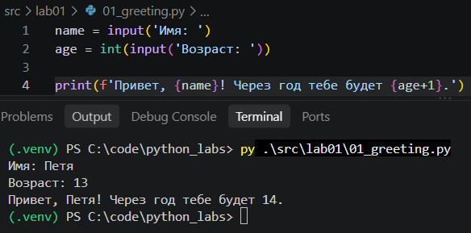
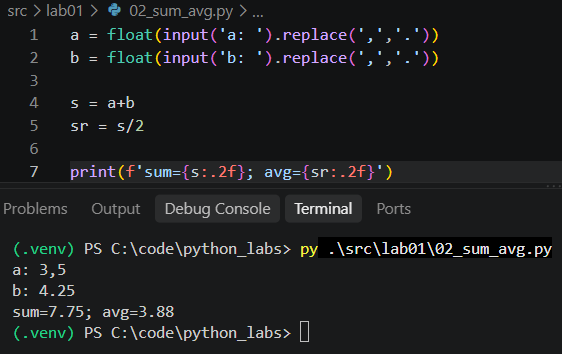
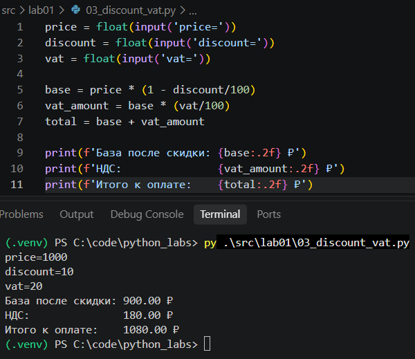
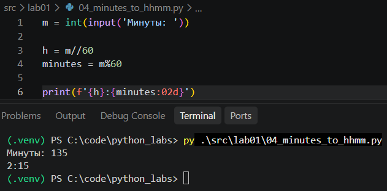
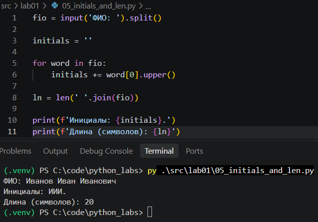
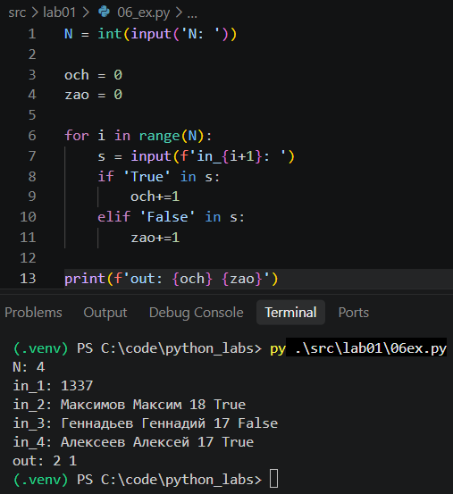
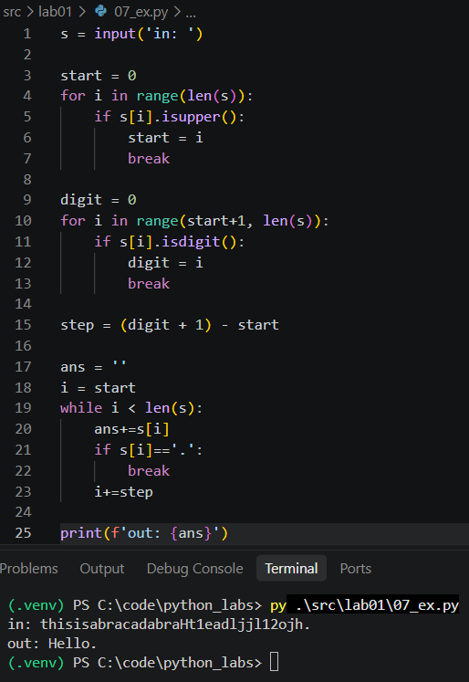

# ЛР1 — Ввод/вывод и форматирование

---

- [Задание 1](#задание-1)
- [Задание 2](#задание-2)
- [Задание 3](#задание-3)
- [Задание 4](#задание-4)
- [Задание 5](#задание-5)
- [Задание 6](#задание-6)
- [Задание 7](#задание-7)

---

## Задание 1
Считываю имя, потом возраст. Возраст перевел в число, чтобы прибавить к нему 1. Вывел через f-строку.

---

## Задание 2
Считываю два числа. Добавил замену запятой на точку, чтобы работало с любым вводом. Считаю сумму, потом делю её на 2, чтобы посчитать среднее.

---

## Задание 3
Особо нечего объяснять. Просто считываю три числа и использую готовые формулы. Дальше просто вывел всё через f-строки с двумя знаками после запятой.

---

## Задание 4
Считываю минуты. Часы – это деление нацело на 60. Остаток минут – это остаток от деления на 60. Вывожу, у минут ставлю 02d, чтобы был ноль спереди.

---

## Задание 5
Разбиваю ФИО на слова через split. Иду циклом по словам, беру первую букву, делаю заглавной и добавляю точку. Потом считаю длину строки, склеив слова обратно через пробел.

---

## Задание 6
Считываю N. Завел два счетчика. В цикле читаю N строк, смотрю – есть ли в строке True или False. Если да, то увеличиваю счетчик. Вывожу оба числа.

---

## Задание 7
Ищу индекс первой заглавной буквы. Потом ищу индекс первой цифры после неё. Шаг – это индекс буквы после цифры минус индекс первой буквы. Дальше циклом while собираю символы, каждый раз прибавляя шаг. Как только встретил точку, остановился.

