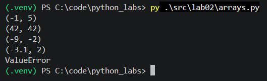
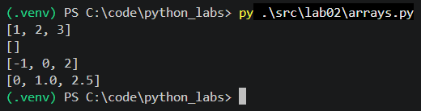
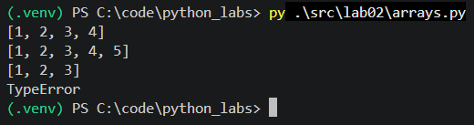
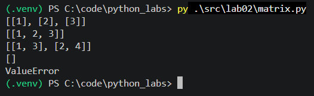
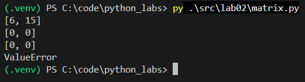
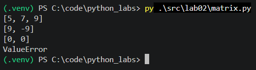
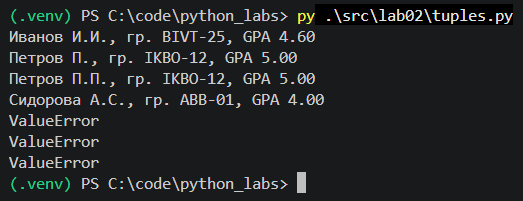

# ЛР2 — Коллекции и матрицы (list/tuple/set/dict)

## Цели и результат

- Освоить операции над списками, кортежами, множествами и словарями.
- Научиться работать с 2D-списками (матрицами) — транспонирование, суммы по строкам/столбцам.
- Аккуратно форматировать текстовые представления записей (на примере студента).

---

- [Задание 1](#задание-1)
- - [min_max](#1-min_max)
- - [unique_sorted](#2-unique_sorted)
- - [flatten](#3-flatten)
-
- [Задание B](#задание-b)
- - [transpose](#1-transpose)
- - [row_sums](#2-row_sums)
- - [col_sums](#3-col_sums)
-
- [Задание C](#задание-c)

---

## Задание 1

### 1) min_max

Функция возвращает (минимум, максимум) из списка чисел.

```py
def min_max(nums: list[float | int]) -> tuple[float | int, float | int]:
    """Возвращает (минимум, максимум) из списка чисел."""

    if len(nums) == 0: raise ValueError("Список пуст")

    mn, mx = nums[0], nums[0]
    for num in nums[1:]:
        if num < mn: mn = num
        if num > mx: mx = num
    return mn, mx
```


### 2) unique_sorted

Функция возвращает отсортированный список уникальных значений по возрастанию.

```py
def unique_sorted(nums: list[float | int]) -> list[float | int]:
    """Возвращает отсортированный список уникальных значений по возрастанию."""

    if len(nums) == 0: return []

    unique_nums = list(set(nums))

    ln = len(unique_nums)
    for i in range(ln):
        for j in range(0, ln-i-1):
            if unique_nums[j] > unique_nums[j + 1]:
                unique_nums[j], unique_nums[j + 1] = unique_nums[j + 1], unique_nums[j]
    return unique_nums
```


### 3) flatten

Функция «расплющивает» список списков или кортежей в один плоский список.

```py
def flatten(mat: list[list | tuple]) -> list:
    """«Расплющивает» список списков или кортежей в один плоский список."""

    result = []

    for row in mat:
        if not isinstance(row, (list, tuple)):
            raise TypeError("Элементы матрицы должны быть списками или кортежами")
        for element in row:
            result.append(element)
    return result
```


---

## Задание B

### 1) transpose

Функция транспонирует прямоугольную матрицу.

```py
def transpose(mat: list[list[float | int]]) -> list[list]:
    """Транспонирует прямоугольную матрицу."""

    if len(mat) == 0: return []
    etalon = len(mat[0])
    for row in mat:
        if len(row) != etalon:
            raise ValueError("Строки разной длины")

    rows = len(mat)
    cols = len(mat[0])

    result = [[0] * rows for _ in range(cols)]

    for i in range(rows):
        for j in range(cols):
            result[j][i] = mat[i][j]
    return result
```


### 2) row_sums

Функция возвращает список сумм элементов по каждой строке прямоугольной матрицы.

```py
def row_sums(mat: list[list[float | int]]) -> list[float]:
    """Возвращает список сумм элементов по каждой строке прямоугольной матрицы."""

    if len(mat) == 0: return []
    etalon = len(mat[0])
    for row in mat:
        if len(row) != etalon:
            raise ValueError("Строки разной длины")

    result = []

    for row in mat:
        row_sum = 0
        for element in row:
            row_sum += element
        result.append(row_sum)
    return result
```


### 3) col_sums

Функция возвращает список сумм элементов по каждому столбцу матрицы.

```py
def col_sums(mat: list[list[float | int]]) -> list[float]:
    """Возвращает список сумм элементов по каждому столбцу матрицы."""

    if len(mat) == 0: return []
    etalon = len(mat[0])
    for row in mat:
        if len(row) != etalon:
            raise ValueError("Строки разной длины")

    rows = len(mat)
    cols = len(mat[0])

    result = [0] * cols
    
    for j in range(cols):
        for i in range(rows):
            result[j] += mat[i][j]
    return result
```


---

## Задание C

Функция форматирует запись о студенте, собирая инициалы и округляя GPA.

```py
def format_record(rec: tuple[str, str, float]) -> str:
    """Форматирует запись о студенте, собирая инициалы и округляя GPA."""

    # 1. Проверка типов данных (TypeError)
    if not isinstance(rec, tuple) or len(rec) != 3:
        raise TypeError("Входные данные должны быть кортежем из 3 элементов")

    fio, group, gpa = rec

    if not isinstance(fio, str) or not isinstance(group, str):
        raise TypeError("ФИО и Группа должны быть строками")
    if not isinstance(gpa, (int, float)):
        raise TypeError("GPA должен быть числом")

    # 2. Проверка корректности значений (ValueError)
    if not fio.strip() or not group.strip():
        raise ValueError("ФИО и Группа не могут быть пустыми строками")
    if not (0.0 <= gpa <= 5.0):
        raise ValueError("GPA должен быть в диапазоне от 0.0 до 5.0")

    words = fio.split()
    if len(words) < 2:
        raise ValueError("ФИО должно содержать как минимум Фамилию и Имя")

    # 3. Сборка фамилии и инициалов
    last_name = words[0].capitalize()
    initials = f"{words[1][0].upper()}."
    if len(words) >= 3:
        initials += f"{words[2][0].upper()}."

    return f"{last_name} {initials}, гр. {group.strip()}, GPA {gpa:.2f}"
```
